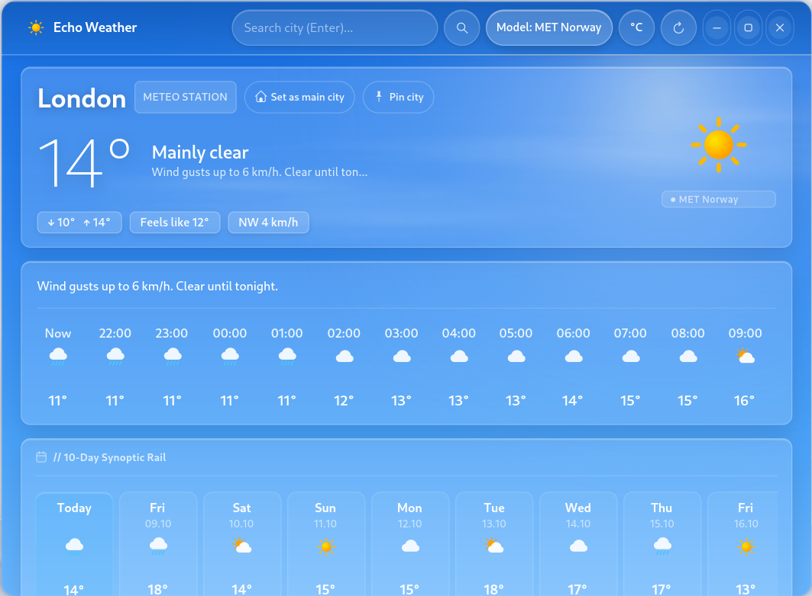
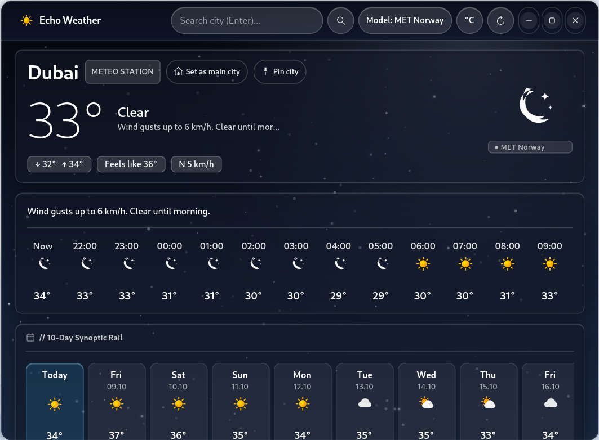
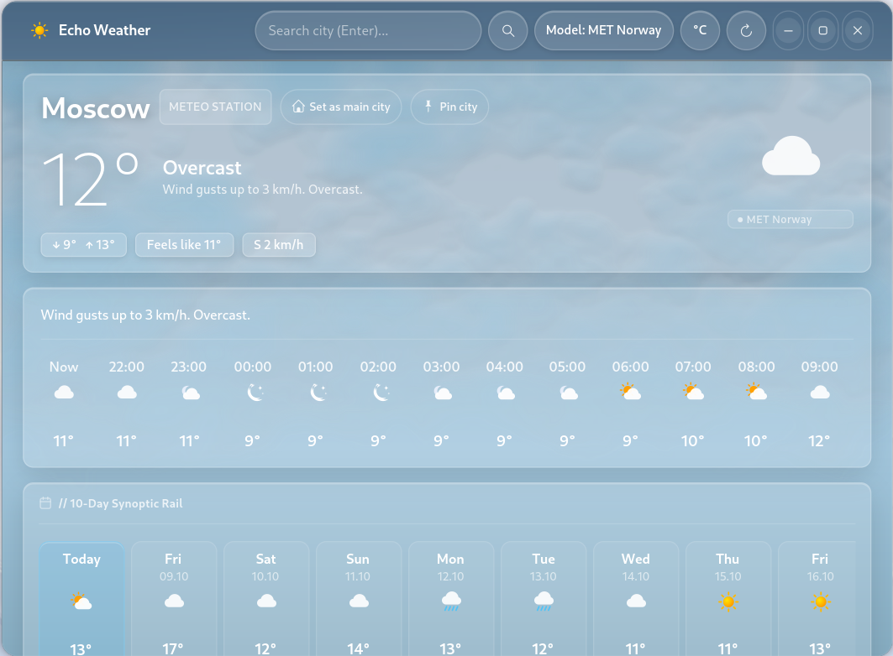
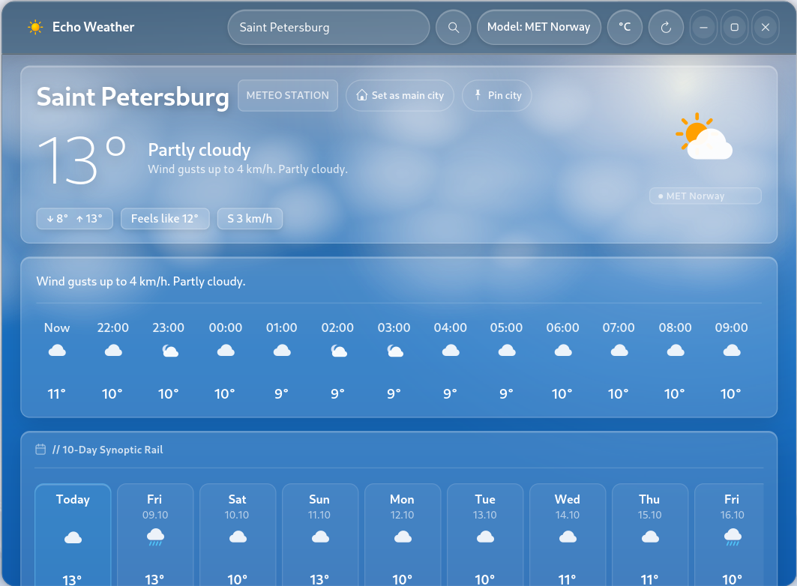
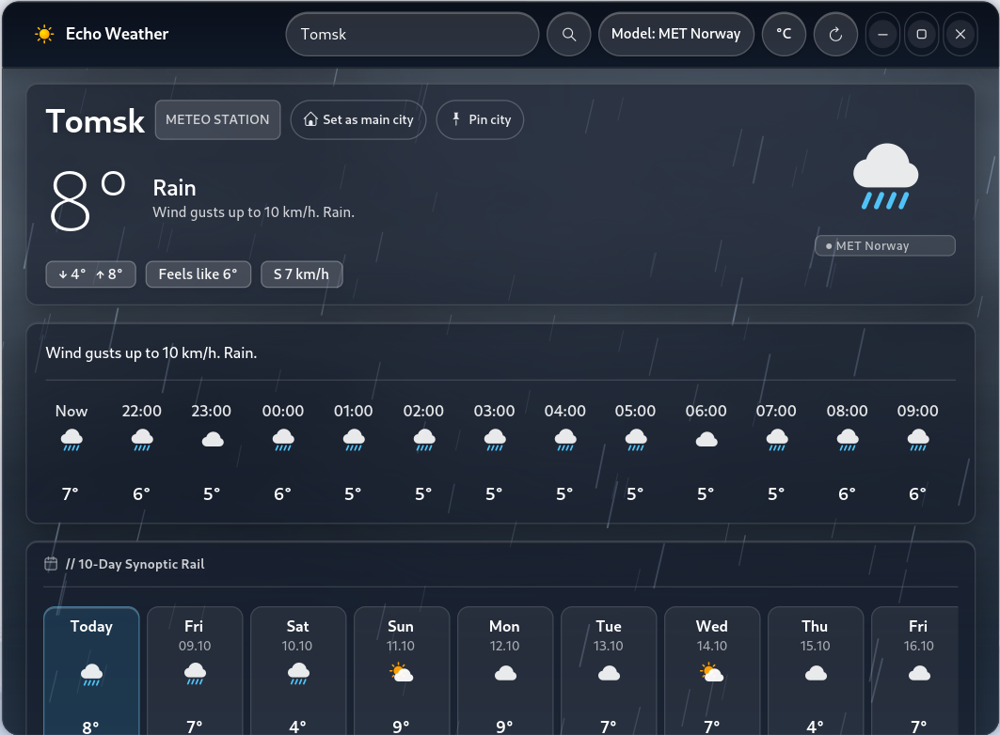
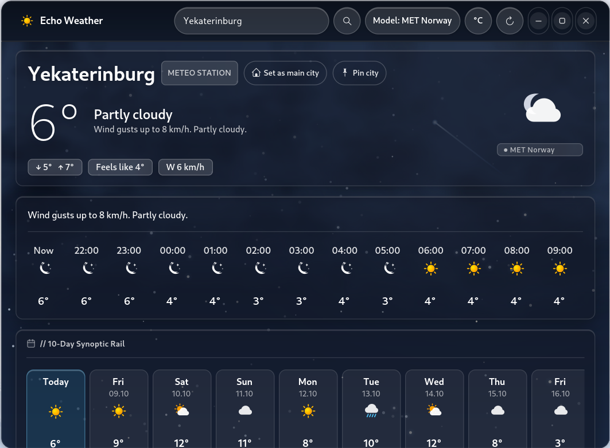

<div align="center">


&nbsp;&nbsp;&nbsp;&nbsp;


# Echo Weather

GNOME, Cinnamon, and universal Linux desktop application displaying meteorological forecasts. Works across all distributions and desktop environments (GNOME, Cinnamon, KDE Plasma, XFCE, MATE, LXQt, COSMIC, tiling WMs). Written in Python with GTK4, Cairo, and optional Libadwaita.

[English](#echo-weather) | [Русский](#echo-weather-ru)

[](https://github.com/dezaetterg/echo-weather/releases)
[](LICENSE)
[](https://github.com/dezaetterg/echo-weather)
[](https://www.gtk.org/)
[](https://www.python.org/)

</div>

---

## About

Echo Weather retrieves weather forecasts from multiple sources and displays them in a modern GTK4 interface. Built for universal Linux compatibility, it runs on any distribution (Arch Linux, Debian, Ubuntu, Linux Mint, Fedora, openSUSE, and more) across all desktop environments (GNOME, Cinnamon, KDE Plasma, XFCE, MATE, LXQt, COSMIC, and tiling window managers). It uses native GTK 4 and Cairo rendering with automatic Libadwaita integration when present and a built-in fallback mode when Libadwaita is not installed. Data is cached to disk and associated with saved locations. The interface supports Russian and English, switching automatically according to system locale.

---

## Screenshots

<div align="center">


&nbsp;


<br><br>


&nbsp;


<br><br>


&nbsp;


</div>

---

## Features

### Forecast

- Forecast range: 10 days (Open-Meteo), 2 to 9 days (MET Norway)
- Data sources: Consensus (ECMWF + ICON + MET Norway via Open-Meteo), ECMWF IFS, DWD ICON, MET Norway, Open-Meteo
- Source and model selection via interface
- Hourly forecast for current day
- Precipitation: type, intensity, probability
- Wind: direction, speed, gusts (compass and hourly chart)

### Analytics

- Climate normal: comparison of current temperature with 24-hour 80% normal range
- Monthly temperature and precipitation normals table (based on Open-Meteo ERA5 data)
- UV index, visibility, humidity, pressure, snow depth
- Lunar calendar: phase, moonrise/moonset, new moon and full moon dates
- Sunrise and sunset, day length

### Interface

- Multiple saved locations, fast switching
- Temperature units: °C / °F
- Interface language: ru / en (detected from system locale, configurable in settings)
- Disk cache for forecasts and geocoding
- Detailed cards: wind, precipitation, UV, pressure, visibility, humidity, moon, climate, conditions
- Light and dark themes with adaptive atmospheric backgrounds

### Compatibility

- Distributions: works out of the box on Arch, Debian, Ubuntu, Linux Mint, Fedora, openSUSE, and other Linux distributions
- Desktop environments: GNOME, Cinnamon, KDE Plasma, XFCE, MATE, LXQt, COSMIC, as well as tiling window managers (Hyprland, Sway, i3)
- Render engine: pure GTK 4 and Cairo with automatic Libadwaita integration and native GTK 4 fallback

---

## Installation

### System Dependencies

**Arch Linux:**
```bash
sudo pacman -S python python-gobject gtk4 libadwaita python-cairo
```

**Debian / Ubuntu:**
```bash
sudo apt install python3 python3-gi python3-gi-cairo gir1.2-gtk-4.0 gir1.2-adw-1
```

**Fedora:**
```bash
sudo dnf install python3 python3-gobject gtk4 libadwaita
```

### Installation Script

```bash
git clone https://github.com/dezaetterg/echo-weather.git
cd echo-weather
bash install.sh
```

The script verifies dependencies, copies application files to `~/.local/share/echo-weather`, installs the launcher into `~/.local/bin`, and registers the `.desktop` file. Configuration (`~/.config/echo-weather`) and cache (`~/.cache/echo-weather`) are preserved on reinstallation.

### Running

```bash
echo-weather
```

If `~/.local/bin` is not in `PATH`:
```bash
export PATH="$HOME/.local/bin:$PATH"
```

### Packaging (.deb, Arch .pkg.tar.zst, .tar.zst)

To build packages for your distribution:
```bash
bash packaging/build_packages.sh
```
Outputs in `dist/`:
- `echo-weather-1.0.0.tar.zst` — Universal Zstandard release archive
- `echo-weather-1.0.0-1-any.pkg.tar.zst` — Arch Linux package (`sudo pacman -U dist/echo-weather-1.0.0-1-any.pkg.tar.zst`)
- `echo-weather_1.0.0-1_all.deb` — Debian/Ubuntu package (`sudo dpkg -i dist/echo-weather_1.0.0-1_all.deb`)

### Uninstallation

```bash
bash uninstall.sh
```

Configuration and cache are preserved. For complete removal:
```bash
rm -rf ~/.config/echo-weather ~/.cache/echo-weather
```

---

## Controls

| Action | Shortcut |
|---|---|
| Refresh forecast | `F5` or `Ctrl+R` |
| Focus search | `Ctrl+F` |
| Close detail card | `Escape` or `Alt+Left` |

---

## Development

### Environment Setup

```bash
python3 -m venv .venv --system-site-packages
source .venv/bin/activate
pip install -r requirements-dev.txt
```

### Tests

```bash
PYTHONPATH=. pytest
```

### Linter

```bash
ruff check .
```

---

## License

This project is licensed under the GNU General Public License v3.0. License text is available in [LICENSE](LICENSE).

---

<a id="echo-weather-ru"></a>

# Echo Weather (RU)

Десктопное приложение погоды для всех дистрибутивов Linux и графических окружений. Работает во всех окружениях (GNOME, Cinnamon, KDE Plasma, XFCE, MATE, LXQt, COSMIC, тайлинговые WM). Написано на Python с GTK4, Cairo и опциональным Libadwaita.

[English](#echo-weather) | [Русский](#echo-weather-ru)

[](https://github.com/dezaetterg/echo-weather/releases)
[](LICENSE)
[](https://github.com/dezaetterg/echo-weather)
[](https://www.gtk.org/)
[](https://www.python.org/)

---

## О приложении

Echo Weather получает прогноз погоды из нескольких источников и отображает его в современном GTK4-интерфейсе. Приложение спроектировано для универсальной работы на любых дистрибутивах Linux (Arch Linux, Debian, Ubuntu, Linux Mint, Fedora, openSUSE и др.) во всех графических окружениях (GNOME, Cinnamon, KDE Plasma, XFCE, MATE, LXQt, COSMIC, а также в тайлинговых оконных менеджерах). Интерфейс отрисовывается на чистом GTK 4 и Cairo с автоматической интеграцией стиля Libadwaita в GNOME и встроенным fallback-режимом для окружений без Libadwaita. Данные кешируются на диск и привязываются к сохранённым городам. Интерфейс поддерживает русский и английский язык, переключается автоматически по системной локали.

---

## Скриншоты

<div align="center">


&nbsp;


<br><br>


&nbsp;


<br><br>


&nbsp;


</div>

---

## Возможности

### Прогноз

- Горизонт прогноза: 10 дней (Open-Meteo), от 2 до 9 дней (MET Norway)
- Источники данных: Consensus (ECMWF + ICON + MET Norway через Open-Meteo), ECMWF IFS, DWD ICON, MET Norway, Open-Meteo
- Выбор источника и модели через интерфейс
- Почасовой прогноз на текущий день
- Осадки: тип, интенсивность, вероятность
- Ветер: направление, скорость, порывы (компас и почасовой график)

### Аналитика

- Климатическая норма: сравнение текущей температуры с 80%-м коридором нормы за 24 часа
- Таблица норм температуры и осадков по месяцам (на основе данных Open-Meteo ERA5)
- Индекс UV, видимость, влажность, давление, высота снежного покрова
- Лунный календарь: фаза, восход/заход, даты новолуния и полнолуния
- Восход и закат солнца, продолжительность дня

### Интерфейс

- Несколько сохранённых городов, быстрое переключение
- Единицы температуры: °C / °F
- Язык интерфейса: ru / en (определяется по системной локали, переключается в настройках)
- Дисковый кеш прогнозов и геокодинга
- Детальные карточки: ветер, осадки, UV, давление, видимость, влажность, луна, климат, условия
- Светлая и темная темы с адаптивными атмосферными фонами

### Совместимость

- Дистрибутивы: бесшовная работа из коробки на Arch, Debian, Ubuntu, Linux Mint, Fedora, openSUSE и любых других Linux-дистрибутивах
- Графические окружения: GNOME, Cinnamon, KDE Plasma, XFCE, MATE, LXQt, COSMIC, а также тайлинговые оконные менеджеры (Hyprland, Sway, i3)
- Графический движок: чистый GTK 4 и Cairo с автоматической поддержкой Libadwaita и встроенным fallback-режимом

---

## Установка

### Системные зависимости

**Arch Linux:**
```bash
sudo pacman -S python python-gobject gtk4 libadwaita python-cairo
```

**Debian / Ubuntu:**
```bash
sudo apt install python3 python3-gi python3-gi-cairo gir1.2-gtk-4.0 gir1.2-adw-1
```

**Fedora:**
```bash
sudo dnf install python3 python3-gobject gtk4 libadwaita
```

### Установка через скрипт

```bash
git clone https://github.com/dezaetterg/echo-weather.git
cd echo-weather
bash install.sh
```

Скрипт проверяет зависимости, копирует файлы в `~/.local/share/echo-weather`, устанавливает лаунчер в `~/.local/bin` и регистрирует `.desktop`-файл. Конфиг (`~/.config/echo-weather`) и кеш (`~/.cache/echo-weather`) при повторной установке не перезаписываются.

### Запуск

```bash
echo-weather
```

Если `~/.local/bin` не в `PATH`:
```bash
export PATH="$HOME/.local/bin:$PATH"
```

### Сборка пакетов (.deb, Arch .pkg.tar.zst, .tar.zst)

Сборка готовых пакетов под дистрибутивы:
```bash
bash packaging/build_packages.sh
```
Файлы в `dist/`:
- `echo-weather-1.0.0.tar.zst` — Универсальный архив Zstandard
- `echo-weather-1.0.0-1-any.pkg.tar.zst` — Пакет для Arch Linux (`sudo pacman -U dist/echo-weather-1.0.0-1-any.pkg.tar.zst`)
- `echo-weather_1.0.0-1_all.deb` — Пакет для Debian/Ubuntu (`sudo dpkg -i dist/echo-weather_1.0.0-1_all.deb`)

### Удаление

```bash
bash uninstall.sh
```

Конфигурация и кеш при этом сохраняются. Для полного удаления:
```bash
rm -rf ~/.config/echo-weather ~/.cache/echo-weather
```

---

## Управление

| Действие | Клавиши |
|---|---|
| Обновить прогноз | `F5` или `Ctrl+R` |
| Перейти в поиск | `Ctrl+F` |
| Закрыть детальную карточку | `Escape` или `Alt+Left` |

---

## Разработка

### Окружение

```bash
python3 -m venv .venv --system-site-packages
source .venv/bin/activate
pip install -r requirements-dev.txt
```

### Тесты

```bash
PYTHONPATH=. pytest
```

### Линтер

```bash
ruff check .
```

---

## Лицензия

Проект распространяется под лицензией GNU General Public License v3.0. Текст лицензии - в файле [LICENSE](LICENSE).
